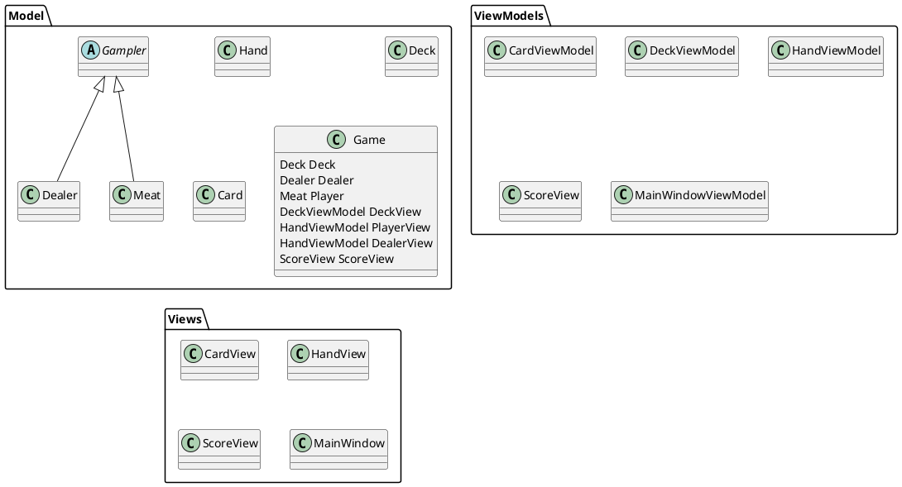

# C# practice

This repository contains the results of the test tasks of the C# developer course from skillBox.

The tasks were completed by Rinat Levchuk (rinat.levchuk@gmail.com).

## Hello world

The program prints a welcome message to the console, reads the code of the entered character, and exits.

## Variables basics

Main aim of this practice:

- variable definition and use;
- type conversion;
- use of string interpolation;
- basics of C# operators and syntaxis.

Second goal is use record for encapsulation complex data instead of many variables.

Program waiting for pressed key and produce table of student's records.

## Blackjack game (PoC)

PoC realisation of Blackjack game.

Main aim of this practice:

- complete task 3.2 of course;
- studing C# object model;
- studing MVVM model.

Second goal is take first look of Avalonia UI.

This program is Blackjack game realisation on Avalonia UI, in future.

For now I'm stuck in ReactiveUI using, so program has problem with view update upon objects change.

Structure of program on diagram below. For event processing (on card click) i'm passing Action to owner
class with `System.Action<>`.



Main of my problem in this code:

```cs
// MainWindowViewModel::MainWindowViewModel
public MainWindowViewModel()
{
    DeckView = Game.DeckView;
    DealerView = Game.DealerView;
    PlayerView = Game.PlayerView;
    ScoreView = Game.ScoreView;

    //? this works as expected, view updated
    Game.AddCardToDealer(new Card(CardSuit.Club, CardName.Ace));
    Game.AddCardToDealer(new Card(CardSuit.Club, CardName.Ten));

    //? this works as expected, view updated
    Game.AddCardToPlayer(new Card(CardSuit.Club, CardName.Ace));
    Game.AddCardToPlayer(new Card(CardSuit.Club, CardName.Ten));
}

// Game::OnDeckCurrent (event process method)
public void OnDeckCurrent()
{
    // fixme: event processing works, but not cause view update
    if (PlayerTurn)
    {
        this.AddCardToPlayer(new Card(Deck.Card.Suit, Deck.Card.Name));
    }
}
```
