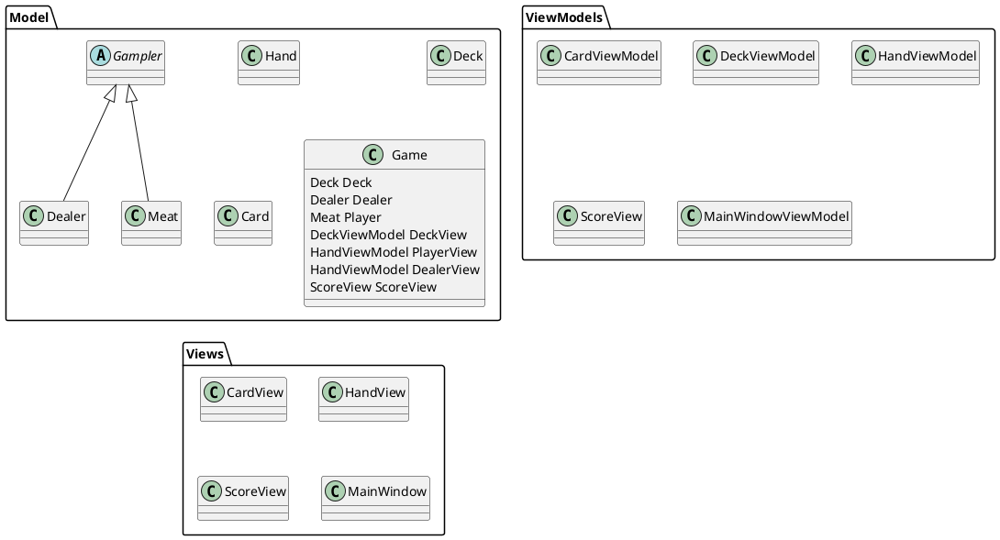

This repository contains the results of the test tasks of the C# developer course from skillBox.

The tasks were completed by Rinat Levchuk (rinat.levchuk@gmail.com).

# Hello world (ex. 1.1, 1.2)

The program prints a welcome message to the console, reads the code of the entered character, and exits.

# Variables basics (ex. 2.1, 2.2)

****
Main aim of this practice:

- variable definition and use;
- type conversion;
- use of string interpolation;
- basics of C# operators and syntaxis.

Second goal is use record for encapsulation complex data instead of many variables.

Program waiting for pressed key and produce table of student's records.

# Odd and even numbers (ex. 3.1)

Work in progress

# Blackjack game (PoC, ex. 3.2)

PoC realisation of Blackjack game.

Main aim of this practice:

- complete task 3.2 of course;
- studing C# object model;
- studing MVVM model.

Second goal is take first look of Avalonia UI.

This program is Blackjack game realisation on Avalonia UI, in future.

For now I'm stuck in ReactiveUI using, so program has problem with view update upon objects change.

Structure of program on diagram below. For event processing (on card click) i'm passing Action to owner
class with `System.Action<>`.



Main of my problem in this code:

```cs
// MainWindowViewModel::MainWindowViewModel
public MainWindowViewModel()
{
    DeckView = Game.DeckView;
    DealerView = Game.DealerView;
    PlayerView = Game.PlayerView;
    ScoreView = Game.ScoreView;

    //? this works as expected, view updated
    Game.AddCardToDealer(new Card(CardSuit.Club, CardName.Ace));
    Game.AddCardToDealer(new Card(CardSuit.Club, CardName.Ten));

    //? this works as expected, view updated
    Game.AddCardToPlayer(new Card(CardSuit.Club, CardName.Ace));
    Game.AddCardToPlayer(new Card(CardSuit.Club, CardName.Ten));
}

// Game::OnDeckCurrent (event process method)
public void OnDeckCurrent()
{
    // fixme: event processing works, but not cause view update
    if (PlayerTurn)
    {
        this.AddCardToPlayer(new Card(Deck.Card.Suit, Deck.Card.Name));
    }
}
```

# Prime numbers (ex. 3.3)

Work in progress

# Random matrix (ex. 4.1)

Main aim of this practice - complete task 4.1 of course (working with arrays).
Second goal is take first look of template classes in C#.

Program waits for matrix specification in form `rows x cols` or `rows:cols` (spaces ignored).

I've some troubles dealing with .net templates:

1. As I understand net templates more limited than C++, so in impossible to do this:

```c++
class RandomMatrix<T t, constexpr int nrows, constexpr int ncols> { /* ... */ }
```

2. c# doesn't allow limitation to base types, `struct` not fit:

```cs
class RandomMatrixGeneric<T> where T : struct { /* ... */ }
```

3. Inside template class I can't use `typeof()` of type parameter without using unsafe.

4. Also in .net no simple way to ensure we in unsafe. Something like that:

```cs
#if usafe
// ...
#endif
```

5. Last but not least, how to do cast conversion with type parameter??

```cs
switch (typeof(T))
{
    case Type t when t.Equals(typeof(double)):
        matrix[rank, j] = rnd.NextDouble(); //! cast error
        rnd.NextDouble();
        break;
    case Type t when t.Equals(typeof(int)):
        matrix[rank, j] = rnd.Next(); //! cast error
        break;
    default:
        throw new System.InvalidOperationException("not implemented");
};
```

PS:  Can I pass tuple as optional param, like that?

```cs
public RandomMatrix(int rows, int cols, (int?, int?) lim = (null, null))
```

# Min search (ex. 4.2)

Main aim of this practice - complete task 4.2 of course (working with multidimensional arrays).

Additional goals:

1. Use regular expressions.
2. Using LINQ.

Program waits for sequence length (spaces ignored).

>Why this happenning?

```cs
int[] array = new int[] {1, 2, 3};

int[] seq = (new int[mc.Count])
              .Select((x, i) =>
              int.Parse(mc[i].Value))
              .ToArray<int>();

Console.Write(array); // 123
Console.Write(seq); // System.Int32[]
```

# Guess number (ex. 4.3)

Main aim of this practice - complete task 4.3 of course (??).

Additional goals:

1. Default parameters.
2. Tuple + switch matching.

To give up during game just type `stop`.

# Sentence's words (ex. 5.1, 5.2)

Tasks 5.1, 5.2 realisation. Do sentence split, sort and print.

Questions:

For example, consider following code:

```cs
string[] res = str.Split(' '); // order as is
Array.Sort(res); // order is ascending
// ... in far far galaxy
// Suppose, we accidentally forget about the called Sort()
SaySentence(res); // voila, we get a mess
```

1. Seems unusual that method can change its args. Looks like some kind of shoot to own leg enabled by
   default.
2. If I want to avoid it I get boilerplate like this?

```cs
static string[] Sort(string[] words)
{
    string[] sorted = (string[]) words.Clone();
    Array.Sort(sorted);
    return sorted;
}
```

# Employees (ex. 6, 7)

Employee database management software.

# Collections

## List for whole numbers (ex. 8.1)

Realisation just due task requirements.
List filled up in constructor.
